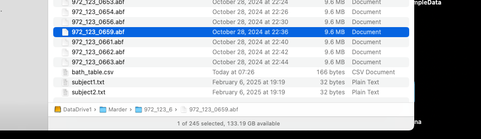
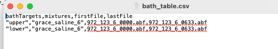
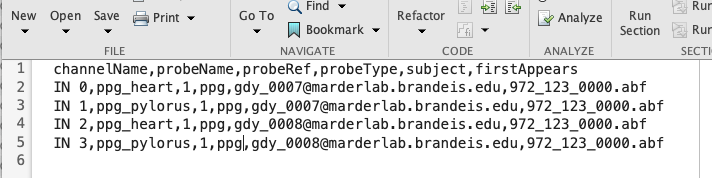

# Tutorial 1 Marder Lab data and NDI

## 1.5 Importing data from a session

### Step 1: Files
Make sure you have your files.

The files should be a set of Axon Instruments ABF files (`EXP_0000.abf`, `EXP_0001.abf`, etc). EXP is usually a string like `972_120`; the first number (`972`) is the lab notebook number and the second number is the page number where the experiment is written (`120`).

Your directory might look like this:

### Step 2: Subjects

One needs to make subject files. Some of Grace’s recordings have two subjects. One makes a subject file simply by creating a text file called `subject1.txt` and `subject2.txt` etc. The text file has a single name. We’ve been naming Grace’s crabs as `gdy007@marderlab.brandeis.edu`, etc.

### Step 3: Bath Table

The Marder lab experiments often involve manipulations of the drugs in the bath. Further, the drugs provided to different tissues can vary; the experimenters can make vaseline wells and restrict the perfusion of certain drugs to specific tissues.

The bath table is a comma separated file:

The mixture strings indicate which mixture(s) in `USERPATH/tools/NDIc-marder-matlab/+ndi/+setup/+conv/+marder/+bath/marder_mixtures.json` and applies them to targets `USERPATH/tools/NDIc-marder-matlab/+ndi/+setup/+conv/+marder/+bath/marder_bathtargets.json`

### Step 5: Initial build of ndi.session object

Run the initial setup that uses the files and the text files to build an ndi.session object:

`S = ndi.setup.conv.marder.presetup(pwd,2)`

### Step 6: Probe table

Update the probe table (`probeTable.csv`, a text file). For Grace’s project the probeName values should be `ppg_heart` or `ppg_pylorus`, as appropriate, the `probeType` is `ppg`, and the reference set to be 1 for the first crab, 2 for the second crab, etc. The table for one experiment looks like:

### Step 7: Do the final post-setup

Run the command `ndi.setup.conv.marder.postsetup(S)`
